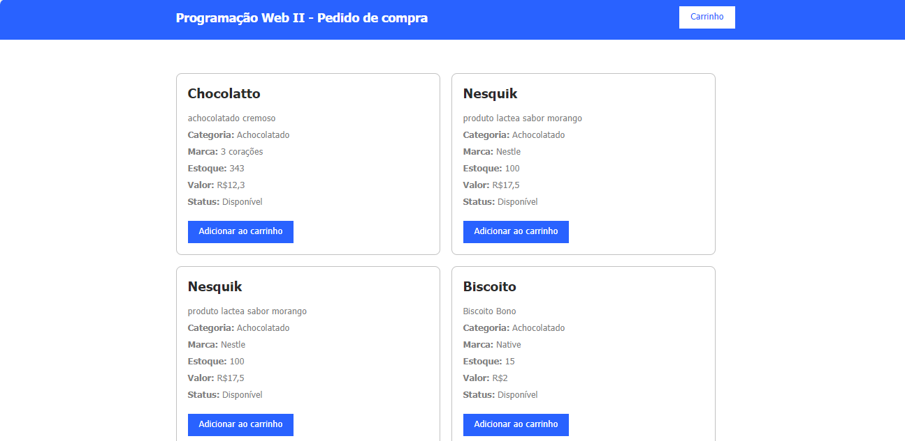
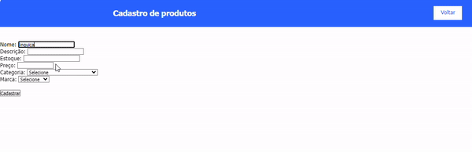
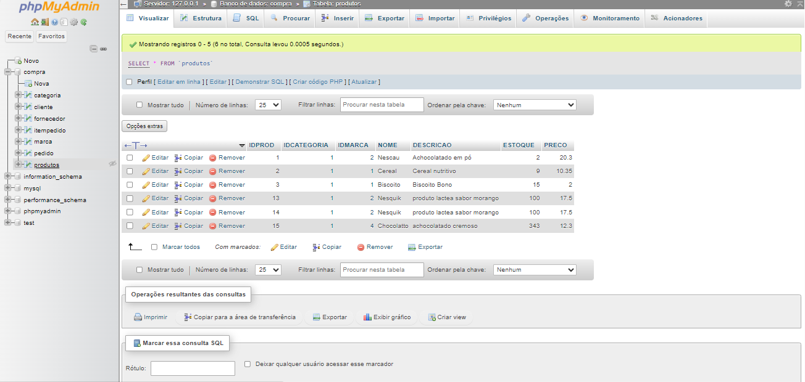

# Cad-Ecommerce

# INDÍCE
[Cadastro de Ecommerce - Introdução](#cadadastro-de-ecommerce---introdu%C3%A7%C3%A3o) 
[Tecnologias utilizadas](#tecnologias-utilizadas)  
[Funcionalidades](#funcionalidades)  
[Considerações finais](#considera%C3%A7%C3%B5es-finais)   

# Cadadastro de Ecommerce - Introdução

Neste projeto foi utilizado os recurso do Mysql em conjunto com a linguagem PHP para desenvolver o banco de dados de um site que simula um carrinho de compras online, na qual é possível cadastrar novos produtos, marcas ou categorias para adicionar ao carrinho.

**O que é o Mysql?**  
MySQL é um sistema de gerenciamento de banco de dados relacional (RDBMS) de código aberto que utiliza a linguagem SQL (Structured Query Language) para gerenciar e manipular dados. Ele é amplamente utilizado em desenvolvimento web e aplicativos empresariais devido à sua confiabilidade, desempenho e facilidade de uso. MySQL é útil para armazenar, organizar e recuperar grandes volumes de dados, facilitando operações como consultas, inserções, atualizações e exclusões de dados em bancos de dados.

## Tecnologias utilizadas
Neste projetos tivemos o uso de:
* HTML 5 
* CSS 3
* PHP
* XAMPP
* MYSQL
* GIT 
* GITHUB

## Funcionalidades
Para o site funcionar de forma devida e correta, trabalhamos com os seguintes recursos:

### Cadastrar 

O código PHP acima recebe uma descrição enviada de um formulário HTML, exibe essa descrição, insere-a na tabela categoria do banco de dados MySQL e, em seguida, informa ao usuário se a inserção foi bem-sucedida ou se ocorreu algum erro. Finalmente, ele fecha a conexão com o banco de dados. No entanto, utilizamos este mesmo formato para construir o código do cadastro de marca e produtos.

### Banco de dados

A linha **include('controller/conexao.php');** no código principal serve para importar o script de conexão com o banco de dados **(conexao.php)**. Isso estabelece a conexão com o banco de dados e define o conjunto de caracteres. Depois, essa conexão é utilizada para executar operações no banco de dados, como a inserção de uma nova marca ou produto.

## Considerações finais
Por enquanto o projeto ainda se encontra em desenvolvimento, logo, ele está incompleto e sujeito a alterações.

Este projeto foi desenvolvido por <strong> Sarah Ozeto </strong>, com a orientação do professor Leonardo Rocha.  
